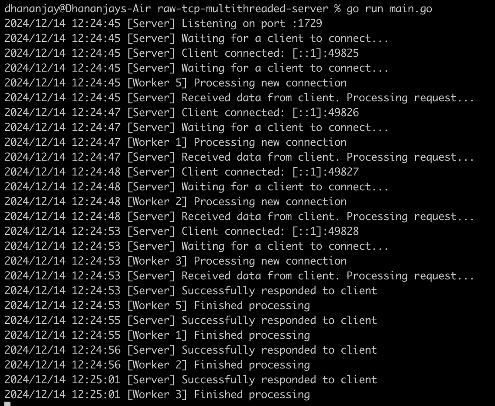

# TCP Server with Worker Pool

A simple yet robust TCP server implemented in Go. This server listens for client connections, processes requests concurrently using a worker pool, and responds with an HTTP-like message.

## Features

- **Concurrent Request Handling**: Uses a worker pool to efficiently process client connections without overwhelming system resources.
- **Connection Timeout**: Prevents clients from holding connections indefinitely by enforcing a timeout.
- **Scalability**: Limits the number of active worker goroutines to avoid excessive thread creation overhead.
- **Graceful Shutdown**: Ensures all workers finish processing before the server shuts down.
- **Enhanced Logging**: Provides detailed logs for monitoring server activities and debugging issues.

## How It Works

1. The server listens on a specified port (`1729` by default).
2. Incoming client connections are accepted and sent to the worker pool for processing.
3. Each connection is handled by a worker, which:
   - Reads the incoming request.
   - Simulates a long-running task.
   - Responds with a simple HTTP message (`hello world!`).
4. Connections exceeding the specified timeout are automatically terminated.

## Configuration

- **Port**: The server listens on port `1729`. You can modify this in the `port` constant.
- **Worker Pool Size**: Configured using `maxWorkers`, currently set to `10`.
- **Connection Timeout**: Set to `10 seconds`, adjustable via `connectionTimeout`.

## Project Structure

- **`main.go`**: The main entry point, containing the server and worker pool implementation.

